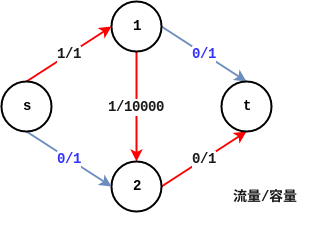
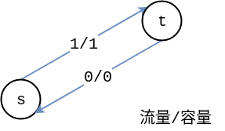

# 网络流学习笔记之最大流

最大流是求在一张网络中从源点**s**出发到汇点**t**的最大流量。(不一定非要单路径)

> 模板题地址 | [**Here**](https://www.luogu.org/problem/P3376)

### FF算法 

我们先给出一张网络每个边上的数字表示**流量/容量**


首先我们考虑一个**错误操作**，错误操作是**寻找增广路**,**存在**就**进行增广**。

假设我们在这张图上找到的**增广路**为 **s->1->2->t**，然后对**找到的增广路**并且进行**增广**，那么会变成下图



之后我们发现再也找不到增广路，这样子我们得出**伪-最大流**为**1**,显然这是**不对**的，这张图的**最大流应该是2**。

于是我们将原来的图中的每一条边**添加一条反向边**，因为建立反向边以后，代表你的程序可以**反悔**，也就是新找到的增广路径**经过反向边**来达到**退流**的目的。


> **s->1**添加反向边类似如下图
>
> 

这样一来我们原来**错误操作**就变成**正确的了**,这就是**Ford-Fulkerson 增广路算法**

### EK算法

**EK**算法的想法是用**BFS**寻找增光路，并进行增流。这边有两个关键的问题

- 如何寻找增广路 ?
- 如何进行增广 ?

解决办法就是用**BFS**一直寻找，每次记录目前**可增广的最大流量**，和这一个位置的**前驱**，直到遇到**源点t**或者**最大可增广为0**，退出**BFS**,判断下**源点t**的**前驱**。

- 源点t的**前驱存在**
  -  使用**先前标记的前驱**进行增广

- 不存在 
  - 代表已经完成得到最大流，**退出返回最大流**

EK算法的时间复杂度是 $ O(nm^2) $  (n是点数，m是边数) `TLE的罪魁祸首`

#### 模板

> 模板来自紫书，存图使用邻接表

```cpp
#define maxn 250
#define INF 0x3f3f3f3f

struct Edge {
  int from, to, cap, flow;
  Edge(int u, int v, int c, int f) : from(u), to(v), cap(c), flow(f) {}
};

struct EK {
  int n, m;
  vector<Edge> edges;
  vector<int> G[maxn];
  int a[maxn];
  int p[maxn];

  void init(int n) {
    for (int i = 0; i < n; i++) G[i].clear();
    edges.clear();
  }

  void AddEdge(int from, int to, int cap) {
    edges.push_back(Edge(from, to, cap, 0));
    edges.push_back(Edge(to, from, 0, 0));
    m = edges.size();
    G[from].push_back(m - 2);
    G[to].push_back(m - 1);
  }

  int Maxflow(int s, int t) {
    int flow = 0;
    for (;;) {
      memset(a, 0, sizeof(a));
      queue<int> Q;
      Q.push(s);
      a[s] = INF;
      while (!Q.empty()) {
        int x = Q.front();
        Q.pop();
        for (int i = 0; i < G[x].size(); i++) {
          Edge& e = edges[G[x][i]];
          if (!a[e.to] && e.cap > e.flow) {
            p[e.to] = G[x][i];
            a[e.to] = min(a[x], e.cap - e.flow);
            Q.push(e.to);
          }
        }
        if (a[t]) break;
      }
      if (!a[t]) break;
      for (int u = t; u != s; u = edges[p[u]].from) {
        edges[p[u]].flow += a[t];
        edges[p[u] ^ 1].flow -= a[t];
      }
      flow += a[t];
    }
    return flow;
  }
};
```
### Dinic

**施工ing**