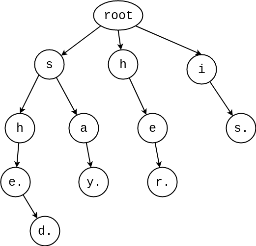

# 字典树 (Trie)

## 简介

字典树是一颗**多叉树**，树上的每一条路径代表一个字符串。

用字符串 "shed","she","say","her","is" , 建立字典树。如下图



我们用 **trie[ u , c ]** 来代表当前节点 **u** 加上字符 c 以后指向的下一个节点，如果没有指向则认为这个节点是结尾

> P.s c的取值与字符集有关。

我们将字符的结尾打上标记，用于不同需求的查找。

我们一般用字典树来进行**查找字符串**操作。

## 字典树-模板


```cpp
const int NodeSize = 1e4+100; //节点数量范围

struct TRIETREE {
    int nxt[NodeSize][26]; //这边默认是 a-z 的字典树
    int exits[NodeSize],cnt;
    TRIETREE() {cnt = 0; /*&& init nxt && exits*/}
    void insertStr(string in,int size) {
        int np = 0,nc; //init np = root
        for(int i=0; i<size; i++) {
            nc = in[i]- 'a';
            if(!nxt[np][nc]) nxt[np][nc] = ++cnt; //代表tire[np,nc] 存在且位于cnt这个节点
            np = nxt[np][nc];
        }
        exits[cnt]++; //代表有n个以之结尾的元素
    }
    bool findStr(string in,int size) {
        int np = 0,nc;
        for(int i=0; i<size; i++) {
            nc = in[i]-'a';
            if(!nxt[np][nc]) return 0; //没有就是不存在
            np = nxt[np][nc];
        }
        return exits[np];
    }
};
```

#### 博客参考

[https://oi-wiki.org/string/trie/](https://oi-wiki.org/string/trie/)
